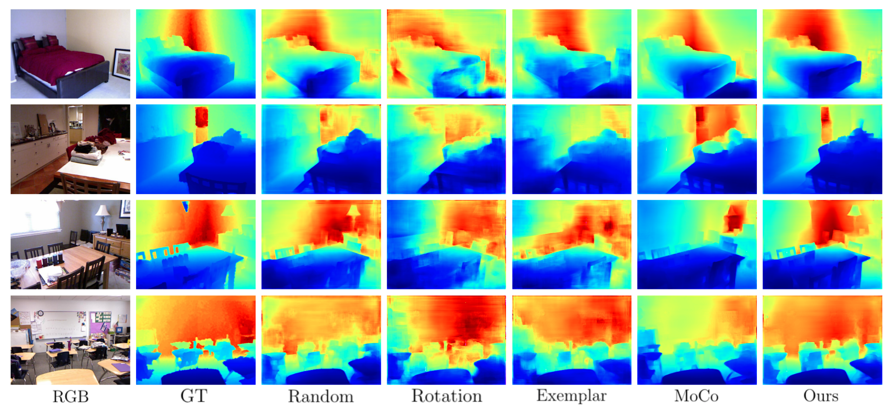
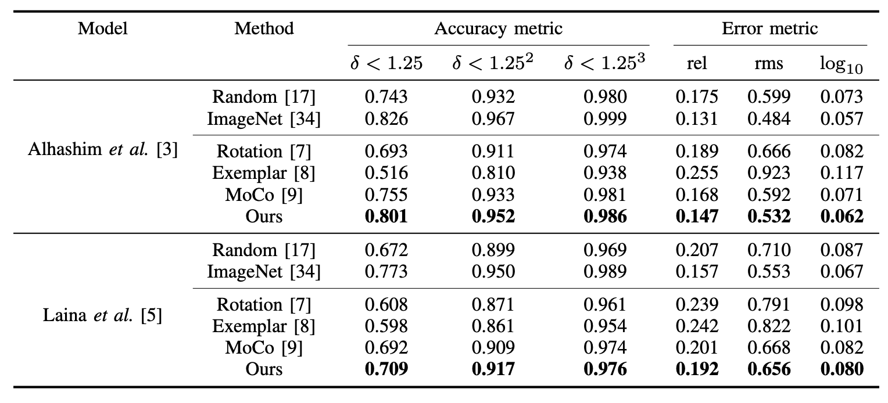

# GrMC

This repo provides an official PyTorch implementation of "Learning a Geometric Representation for Data-Efficient Depth Estimation via Gradient Field and Contrastive Loss" (ICRA 2021). [[paper](https://arxiv.org/abs/2011.03207)]


### Results
<p align="center">
	
  
</p>

### Setup
It is recommended to create a new Anaconda virtual environment for reproduction or evaluation with pretrained models.


```bash
conda create -n grmc python==3.5.6
conda activate grmc
conda install pytorch=1.6.0 torchvision=0.5.0 -c pytorch
```

We ran our experiments with PyTorch 1.6.0, CUDA 10.2, Python 3.5.6 and Ubuntu 18.04. Usage of higher or lower version of PyTorch seems to be incompatible to our pre-trained model.

```bash
pip install pillow==5.2.0 opencv-contrib-python
```
If you do not use Anaconda environment, please use pip3 rather than pip for dependencies with Python3.

### Dataset

Download the subset of preprocessed NYU Depth v2 (50k) [here](https://drive.google.com/drive/folders/1TzwfNA5JRFTPO-kHMU___kILmOEodoBo) for pretraining the encoder and training the depth estimation network ([source](https://github.com/ialhashim/DenseDepth)). Extract the zip file and do not delete it after extraction. The directory is then be like

```plain
└── NYU_Depth_v2_DATASET_ROOT
       |
       ├── data
       |  ├── nyu2_train
       |  ├── nyu2_train.csv
       |  ├── nyu2_test
       |  └── nyu2_test.csv
       |
       └── nyu_data.zip
```

### Pretraining Encoder

Any parametric model can be trained with our proposed self-supervised algorithm, and we provide pretrained models of [ResNet-50](https://drive.google.com/file/d/1kCph-D8uCFeowLY7tdgE09fE0Jn4m3at/view?usp=sharing) and [DenseNet-161](https://drive.google.com/file/d/1F1YsVzF8bPvcrh1vN2WBecOcfVZ_avJw/view?usp=sharing) as the encoder of depth estimation network. Download the pretrained weights and place them in the checkpoints folder to train the depth estimation network with pretrained encoders.


| Encoder  |  batch_size  |
|----------|:--:|
|DenseNet-161| 16 |
|ResNet-50| 64|


We use RTX 2080Ti (11GB) for training the encoder and its batch_size can be resized as you use GPU with different memory size.
```bash
python encoder_pretrain.py --encoder_type=densenet --layers=161 -b=8
```

### Training
We provide weights of two monocular depth estimation networks, [DenseDepth](https://drive.google.com/file/d/1p6shLmmbd69fsFoBhqJB1B1FqGM04J2v/view?usp=sharing) and [FCRN](https://drive.google.com/file/d/1Dv8iglQlCA-lZ9eJhrLU2xypGN87F4hE/view?usp=sharing) with pretrained encoders by our proposed algorithm. Download the pretrained weights and place them on the checkpoints for the evaluation.

| Model  |  Encoder | batch_size|
|----------|:------:|:--:|
|[DenseDepth](https://arxiv.org/abs/1812.11941)| DenseNet-161 |8|
|[FCRN](https://arxiv.org/abs/1606.00373)| ResNet-50|8|
```bash
python train.py --model_type=densedepth --layers=161 --bs=8
```


### Evaluation

Donwload the test data [here](https://drive.google.com/file/d/1LR8Q-YZy1sX7_TBhohMsq8qMNop-8tDi/view?usp=sharing) and place it on the NYU_Depth_v2_DATASET_ROOT without any extraction. Then, run evaluate_pytorch.py to evaluate the performance of the network on NYU Depth v2. All the pretrained weights above must be downloaded in the checkpoints/ directory for the evaluation.

```bash
python evaluate_pytorch.py --model_type=densdepth --layers=161
```

### Reference

Some codes are sourced and modified from DenseDepth([github](https://github.com/ialhashim/DenseDepth)), FCRN([github](https://github.com/dontLoveBugs/FCRN_pytorch)), and MoCo([github](https://github.com/facebookresearch/moco)).
