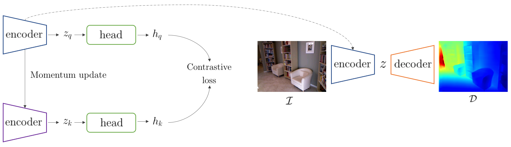

## Learning a Geometric Representation for Data-Efficient Depth Estimation via Gradient Field and Contrastive Loss

### IEEE ICRA 2021 Submission 
This repo provides an official PyTorch implementation of the paper submitted to IEEE ICRA 2021, [https://arxiv.org/abs/2011.03207](https://arxiv.org/abs/2011.03207).

### Introduction




### Results


### Setup
It is recommended to create a new Anaconda virtual environment for reproduction or evaluation with pretrained models.


```bash
conda create -n grmc python==3.5.6
conda activate grmc
conda install pytorch=1.4.0 torchvision=0.5.0 -c pytorch
```

We ran our experiments with PyTorch 1.4.0, CUDA 10.2, Python 3.5.6 and Ubuntu 18.04. Usage of higher or lower version of PyTorch seems to show incompatible to our pre-trained model.

```bash
pip install pillow==5.2.0 opencv-contrib-python
```
If you do not use Anaconda environment, please use pip3 rather than pip for dependencies with Python3.

### Dataset

Download the subset of preprocessed NYU Depth v2 (50k) [here](https://drive.google.com/drive/folders/1TzwfNA5JRFTPO-kHMU___kILmOEodoBo) for both training and inference from DenseDepth [github](https://github.com/ialhashim/DenseDepth).

### Pretraining Encoder

Any parametric model can be trained with our proposed gradient based momentum contrastive learning, and we provide a pretrained models of ResNet-50 and DenseNet-161.
```bash
python encoder_pretrain.py --encoder_type --layers --b
```

### Training
```bash
python train.py --encoder_type --layers --bs
```


### Evaluation

```bash
python evaluate_pytorch.py --model_type --layers
```
